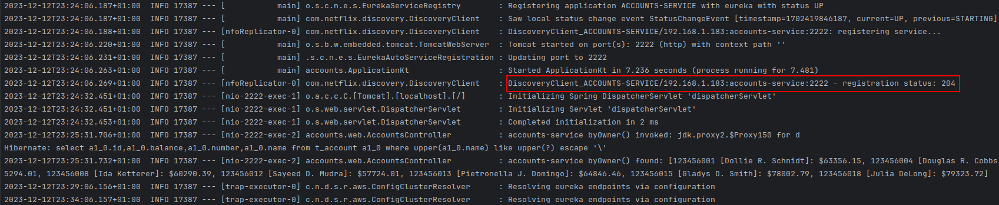
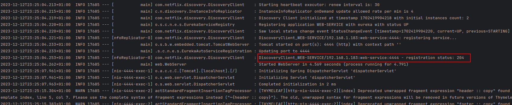
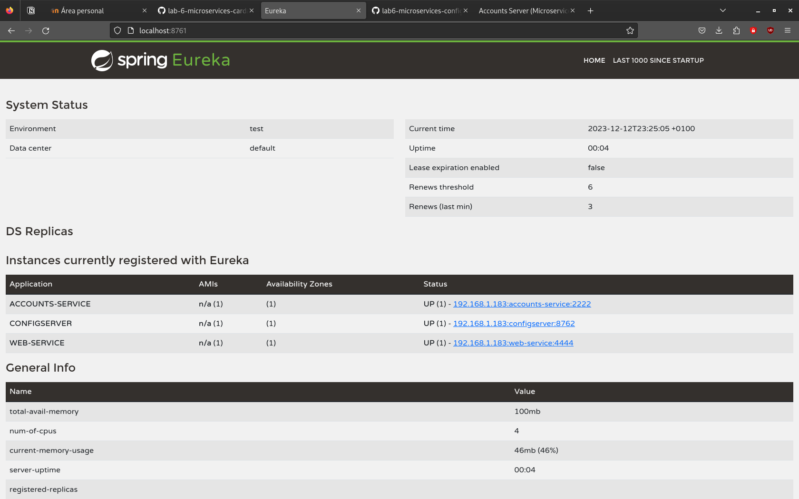
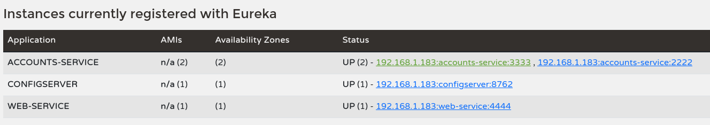
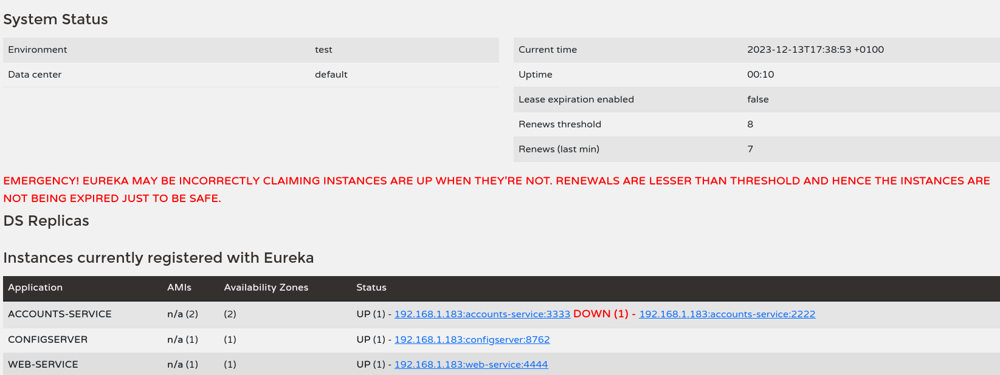
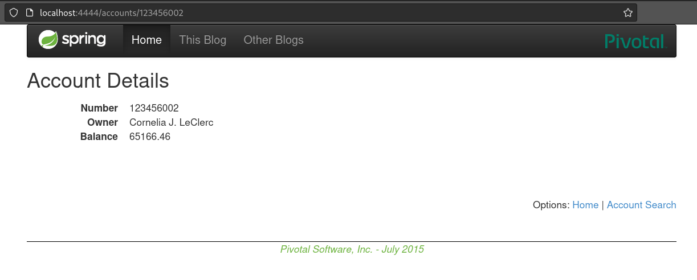
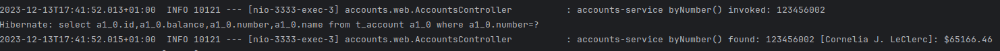
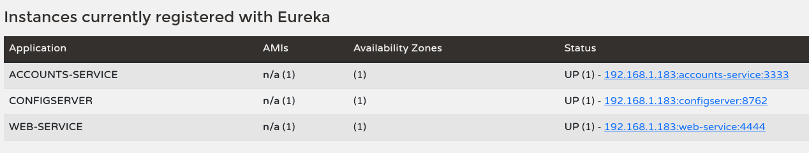
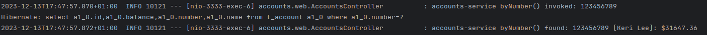

# Práctica 6 - Microservicios
Autor: Carlos Dalmau Gómez (818563)  
Date: 12/12/2023

### Link to the config repository:
https://github.com/cardalgo22/lab6-microservices-config-repo/

### two services `accounts (2222)` and `web` are running and registered:
The service accounts is running on port 2222 and is registered in the Eureka server:
  

The service web is running on port 4444 and is registered in the Eureka server:

### The service registration service has these two services registered:
In the Eureka server we can see the two services registered:

### Update the configuration repository so that the `accounts` service uses now the port 3333:

In the config repository we can see the change in the accounts-service.yml file.  
Link to the commit: https://github.com/cardalgo22/lab6-microservices-config-repo/commit/6583fdf4d74ec78e7e843049d404bf9505702c9a

### Run a second instance of the `accounts` service using the new configuration. What happens?

We can see that the new instance of the accounts service is running on port 3333 and is registered in the Eureka server:

We could do this without stopping the execution of the configuration service, it just gets the new configuration from the git repository and uses it.

### What happens when you kill the service `accounts (2222)` and do requests to `web`?

If we kill the service accounts running on port 2222, we can see that the service is down in the Eureka server:

If we do a request to the web service, we can see that the web service is able to get the information from the accounts service running on port 3333:

And if we check the logs of the accounts service running on port 3333, we can see that the web service is doing requests to the accounts service:

### Can the web service provide information about the accounts again?. Why?

When we try to do a request to the web service, we can see that the web service is again able to get the information from the accounts service.
This is because the web service is able to get the information from the accounts service running on port 3333, which is registered in the Eureka server:

And also when we check the logs of the accounts service running on port 3333, we can see that the web service is doing requests to the accounts service:

So we can see that, thanks to the Eureka server and the configuration server, we can change the configuration or either add or remove instances of a service without stopping the execution of the other services.